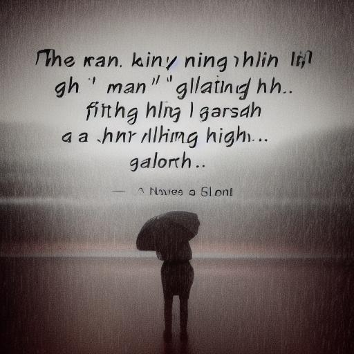
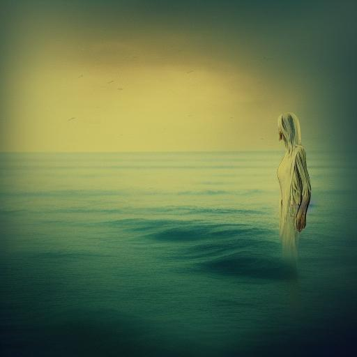
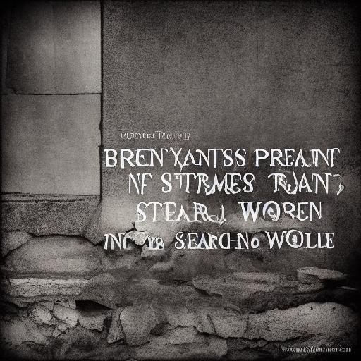
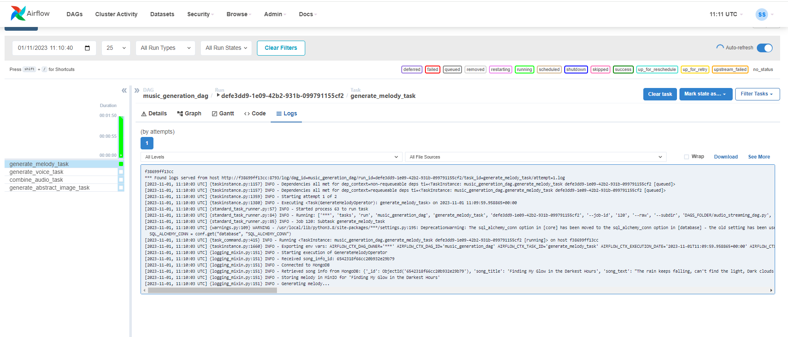
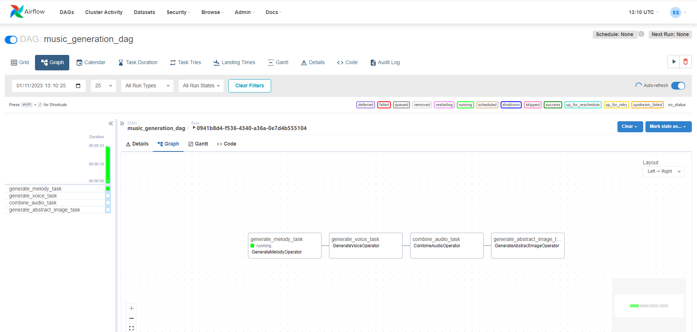
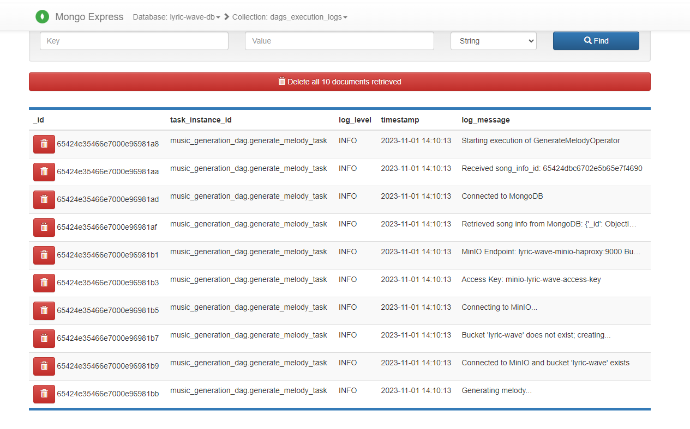
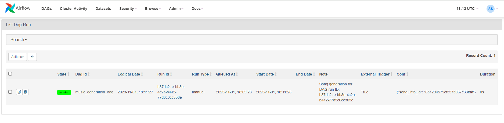
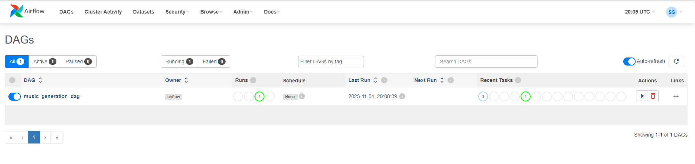
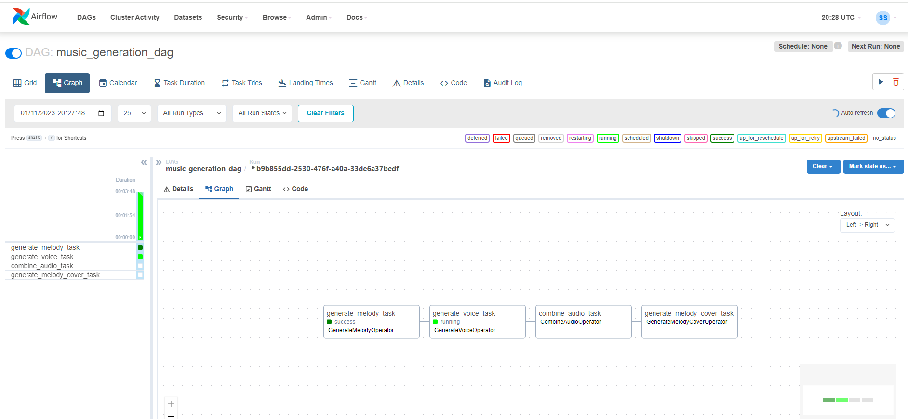

# LyricWave: AI-Powered Music Generation Platform

Step into the world of music with LyricWave, a cutting-edge AI-driven platform that brings together the art of music creation and technology. 🎶🤖

At LyricWave, we merge the power of AudioCraft for melody generation, Sona.ai Bark for voice cloning and song vocals, and harness the capabilities of a Stable Diffusion model to create stunning song cover images. 🎤🖼️

LyricWave isn't just a platform; it's a gateway to a new dimension of musical expression. It's a world where technology and creativity harmonize, resulting in songs that touch your heart and soul. With LyricWave, you can explore, experiment, and embark on a musical journey like never before. 🚀🎶

<p align="center">
  
  
  
  
  
  
  
  
</p>

## Key Features
- 🎵 **Melody Magic:** The integration with AudioCraft from Meta crafts melodies that perfectly match the lyrical sentiment, resulting in captivating musical compositions.

- 🎤 **Voice Cloning:** Sona.ai Bark's voice cloning technology provides expressive and lifelike synthetic vocals, ensuring that your songs are beautifully sung.

- 🎶 **Harmonious Fusion:** We seamlessly blend AI-generated melodies and synthetic voices to produce harmonious MP3 tracks that offer a unique and immersive listening experience, capturing both the musical and lyrical essence.

- 🖼️ **Abstract Visuals:** In addition to enchanting music, LyricWave generates mesmerizing abstract images inspired by the song's lyrical content, providing a visual representation of the musical narrative.

- 📦 **MongoDB Integration:** LyricWave effortlessly integrates with MongoDB to store comprehensive song details, including melodies, vocals, abstract images, and metadata.

- 🐳 **Docker-Powered Workflow:** Our Docker Compose environment simplifies the deployment and orchestration of the entire music generation pipeline, ensuring a smooth workflow.

- 🚀 **Apache Airflow DAG:** We have modeled this entire music generation process as a DAG in Apache Airflow, making it easy to schedule, monitor, and manage your music creation tasks.

Whether you're an artist, songwriter, or just someone looking for a unique musical experience, LyricWave has you covered. 📝🎼 Unleash your inner composer and let LyricWave transform your words into beautiful melodies. Get ready to embark on a musical journey like never before! 🚀🎶

## Technologies Used

- **Sona.AI Bark 🐶:** Sona.AI Bark is a transformer-based text-to-audio model created by Suno. Bark can generate highly realistic, multilingual speech as well as other audio, including music, background noise, and simple sound effects. The model can also produce nonverbal communications like laughing, sighing, and crying. These pretrained model checkpoints are available for commercial use.
- **MusicGen from AudioCraft 🎵:** MusicGen is a simple and controllable model for music generation provided by AudioCraft. It is a single-stage auto-regressive Transformer model trained over a 32 kHz EnCodec tokenizer with 4 codebooks sampled at 50 Hz. Unlike existing methods, MusicGen doesn't require self-supervised semantic representation, and it generates all 4 codebooks in one pass. It uses 20,000 hours of licensed music for training, including an internal dataset of 10,000 high-quality music tracks as well as ShutterStock and Pond5 music data.
- **Stable Diffusion Model 🖼️:** The Stable Diffusion Model is a latent text-to-image diffusion model capable of generating photorealistic images from any text input. It's based on diffusion technology and is capable of producing stunning visual representations based on text.
- **Apache Airflow 🛠️:** Apache Airflow is an extensible platform for orchestrating complex workflows. In the context of LyricWave, it's used to schedule and manage the music generation process.
- **Flask 📡:** Flask is a lightweight web framework used to build the API that allows users to initiate and manage music generation tasks in LyricWave.
- **MongoDB 📊:** MongoDB is a versatile NoSQL database used to store and retrieve information about generated songs, including melodies, synthetic voices, abstract images, and metadata.
- **MinIO 🗄️:** MinIO is an open-source object storage server used to store generated files, such as images and audio files.
- **HAProxy 🔄:** HAProxy is a load balancer responsible for managing traffic between various components of LyricWave.
- **Redis 📦:** Redis is an in-memory database used to store temporary data and facilitate communication between LyricWave services.
- **Celery Flower 🌸:** Celery Flower is a monitoring and management tool for Celery, which handles the execution of asynchronous tasks in the LyricWave platform.

With this technology stack, LyricWave offers a unique and powerful music generation experience. Experience the magic of AI-generated music today! 🎶🚀

## Song Examples

In this section, you'll find a collection of AI-generated songs, each with its unique cover art and lyrics. Dive into the world of music created by LyricWave and discover the diversity of melodies and emotions that AI can craft. Explore these musical pieces, listen to their harmonious tunes, and appreciate the artistry of AI-driven music generation.

### "Find my Glow"

#### Song Cover

 

#### Song lyrics

```
  ♪ The rain keeps falling, it's a never-ending night,
    But I'll keep fighting, I won't lose the fight.
    Though the world is heavy, a burden on my chest,
    In the darkest hours, I'll find my glow. ♪
```

https://github.com/sergio11/lyric_wave_architecture/assets/6996211/ce870367-051e-4915-b7c4-c5edd4a615c3

* **Meaning**: The song "Find My Glow" is a message of resilience and determination in the face of adversity. Despite the continuous rain and the feeling of an everlasting night, the narrator refuses to give up. The lyrics reflect a sense of heaviness and emotional burden, which could represent life's challenges and struggles.

### "Rise and Shine"

#### Song Cover

 

#### Song lyrics

```
  ♪ Rise and shine, you're a star so bright, With your spirit strong,
   take flight, In your eyes, a world of possibility,
   Embrace the day, and set your spirit free. ♪
```

https://github.com/sergio11/lyric_wave_architecture/assets/6996211/3c20e936-4bc3-4c78-8ffe-c44ba9d03f43

* **Meaning**: The song "Rise and Shine" is an uplifting message of hope and empowerment. It encourages the listener to embrace their inner strength and face the world with a positive attitude."

### "Fading Echoes"

#### Song Cover


#### Song lyrics

```
  ♪ I'm lost in the shadows of our yesterdays, Fading echoes,
    in a melancholy haze. Your absence lingers, in the spaces between,
    In this quiet solitude, I'm forever unseen. ♪
```

https://github.com/sergio11/lyric_wave_architecture/assets/6996211/50a608b8-a7b2-4a44-966d-e1b2262ae336

* **Meaning**: This song is about loss and the passage of time. It captures the feeling that memories of a loved one fade over time, leaving behind a sense of melancholy.

### "Fading Memories"

#### Song Cover



https://github.com/sergio11/lyric_wave_architecture/assets/6996211/7ec6485f-78f2-4a90-8bbd-09f82fb771be

#### Song lyrics

```
  ♪ I'm drowning in these fading memories, Lost in time,
    lost at sea. Your ghost still haunts my heart, it seems,
    In this endless night, I'm lost in dreams. ♪
```

* **Meaning**: The song "Fading Memories" is a melancholic reflection on the experience of loss and nostalgia. The lyrics paint a picture of someone who is deeply affected by fading memories of a past love.

### "Broken Promises"

#### Song Cover



#### Song lyrics

```
  ♪ Broken promises, shattered dreams, In the silence,
    nothing's as it seems. Our love, once strong, now torn apart,
    In the ruins of our world, I search for a fresh start.  ♪
```

https://github.com/sergio11/lyric_wave_architecture/assets/6996211/f93707d1-45fd-473c-8395-d346079bb4d1

* **Meaning**: The song "Broken Promises" is a reflection on the pain and disappointment that can come from unfulfilled commitments and shattered dreams in a relationship.

### Wounds of Time

#### Song Cover


#### Song lyrics

```
  ♪ Wounds of time, they run so deep,
    In the dark, my secrets I keep.
    The echoes of the past, they won't subside,
    In the shadows of my heart, I silently hide.  ♪
```

https://github.com/sergio11/lyric_wave_architecture/assets/6996211/d87e5c46-1337-4a5c-a9a1-0a25b117222c

* **Meaning**: The song "Wounds of Time" delves into the weight of emotional scars and the secrets kept deep within the narrator's heart.









## Getting Started
1. Clone this repository to your local machine.
2. Configure environment variables in `.env` to tailor the project settings to your requirements.
3. Execute `docker-compose up` to initiate the project within the Docker Compose environment.
4. Access the Airflow UI at `http://localhost:8080` to trigger and monitor music generation tasks.
5. Utilize the Flask API at `http://localhost:5000` for requesting music streaming and initiating the composition process.

## Contribution
Contributions to LyricWave are highly encouraged! If you're interested in adding new features, resolving bugs, or enhancing the project's functionality, please feel free to submit pull requests.

## License
This project is licensed under the [MIT License](LICENSE).

## Credits

LyricWave is developed and maintained by **Sergio Sánchez Sánchez** (Dream Software). Special thanks to the open-source community and the contributors who have made this project possible.
If you have any questions, feedback, or suggestions, feel free to reach out at dreamsoftware92@gmail.com.

