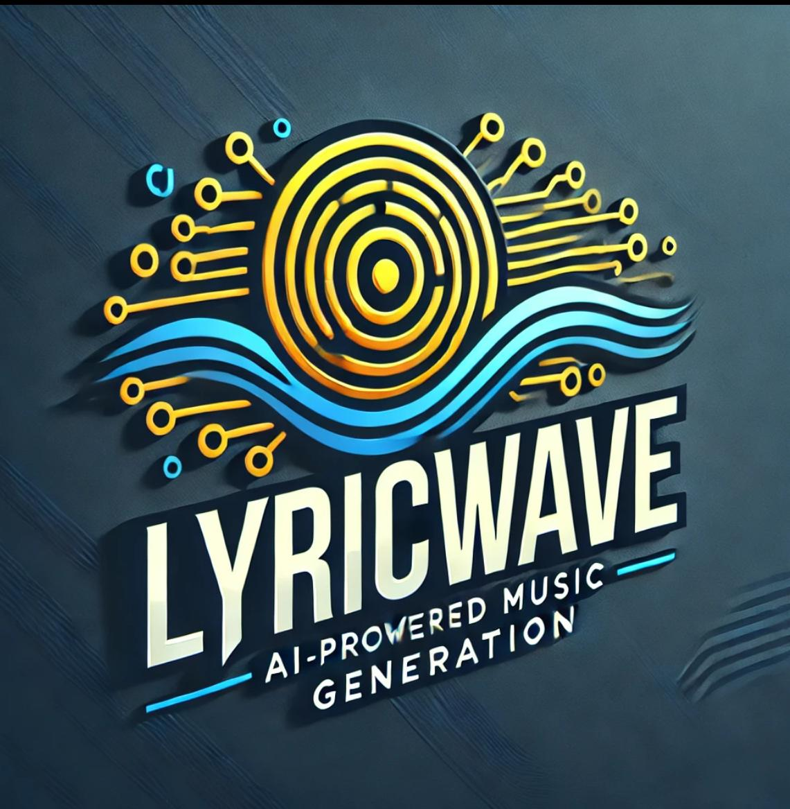

# 🎵 LyricWave: The AI-Powered Music Generation Platform 🎶



Step into the world of music with LyricWave, a cutting-edge AI-driven platform that brings together the art of music creation and technology. 🎶🤖

At LyricWave, we merge the power of AudioCraft for melody generation, Suno-AI Bark for voice cloning and song vocals, and harness the capabilities of a Stable Diffusion model to create stunning song cover images. 🎤🖼️

LyricWave isn't just a platform; it's a gateway to a new dimension of musical expression. It's a world where technology and creativity harmonize, resulting in songs that touch your heart and soul. With LyricWave, you can explore, experiment, and embark on a musical journey like never before. 🚀🎶

<p align="center">
  
  
  
  
  
  
  
  
  
  
  
</p>

## ⚠️ Disclaimer

**LyricWave** is an **experimental AI-driven music generation platform** designed for **creative exploration** and **educational purposes**. While LyricWave integrates advanced technologies such as **AudioCraft** for melody generation, **Suno-AI Bark** for voice cloning, and **Stable Diffusion** for cover image creation, it is **not intended for commercial production use**.

This platform combines the capabilities of various AI models to create music and accompanying artwork, but the generated content may **not always meet professional standards**. The voice cloning and music synthesis processes are **experimental**, and the quality of output may vary.

The **logo of LyricWave** was **generated by ChatGPT** and is **free of copyright restrictions**. It is provided exclusively for **demonstration and educational purposes** and does not represent an actual brand or commercial entity.  

## More Details 📝

For comprehensive information about this project, check out this [Medium article](https://sanchezsanchezsergio418.medium.com/a-glimpse-into-ai-powered-song-generation-with-lyricwave-fb071b9a0fe0).

## Key Features
- 🎵 **Melody Magic:** The integration with AudioCraft from Meta crafts melodies that perfectly match the lyrical sentiment, resulting in captivating musical compositions.

- 🎤 **Voice Cloning:** Suno-AI Bark's voice cloning technology provides expressive and lifelike synthetic vocals, ensuring that your songs are beautifully sung.

- 🎶 **Harmonious Fusion:** We seamlessly blend AI-generated melodies and synthetic voices to produce harmonious MP3 tracks that offer a unique and immersive listening experience, capturing both the musical and lyrical essence.

- 🖼️ **Abstract Visuals:** In addition to enchanting music, LyricWave generates mesmerizing abstract images inspired by the song's lyrical content, providing a visual representation of the musical narrative.

- 📦 **MongoDB Integration:** LyricWave effortlessly integrates with MongoDB to store comprehensive song details, including melodies, vocals, abstract images, and metadata.

- 🐳 **Docker-Powered Workflow:** Our Docker Compose environment simplifies the deployment and orchestration of the entire music generation pipeline, ensuring a smooth workflow.

- 🚀 **Apache Airflow DAG:** We have modeled this entire music generation process as a DAG in Apache Airflow, making it easy to schedule, monitor, and manage your music creation tasks.
  
- 📑 **Advanced Text Search:** LyricWave harnesses Elasticsearch to index the text of songs, enabling advanced and efficient text-based searches for simple terms. This feature allows users to find songs, even if they only remember a few words from the lyrics.

Whether you're an artist, songwriter, or just someone looking for a unique musical experience, LyricWave has you covered. 📝🎼 Unleash your inner composer and let LyricWave transform your words into beautiful melodies. Get ready to embark on a musical journey like never before! 🚀🎶

## Technologies Used

- **Suno-AI Bark 🐶:** [Suno-AI Bark](https://github.com/suno-ai/bark) is a transformer-based text-to-audio model created by Suno. Bark can generate highly realistic, multilingual speech as well as other audio, including music, background noise, and simple sound effects. The model can also produce nonverbal communications like laughing, sighing, and crying. These pretrained model checkpoints are available for commercial use.
- **MusicGen from AudioCraft 🎵:** [MusicGen](https://github.com/facebookresearch/audiocraft) is a simple and controllable model for music generation provided by AudioCraft. It is a single-stage auto-regressive Transformer model trained over a 32 kHz EnCodec tokenizer with 4 codebooks sampled at 50 Hz. Unlike existing methods, MusicGen doesn't require self-supervised semantic representation, and it generates all 4 codebooks in one pass. It uses 20,000 hours of licensed music for training, including an internal dataset of 10,000 high-quality music tracks as well as ShutterStock and Pond5 music data.
- **Stable Diffusion Model 🖼️:** [The Stable Diffusion Model](https://huggingface.co/runwayml/stable-diffusion-v1-5) is a latent text-to-image diffusion model capable of generating photorealistic images from any text input. It's based on diffusion technology and is capable of producing stunning visual representations based on text.
- **Elasticsearch 🔍:** [Elasticsearch](https://www.elastic.co/es/elasticsearch) is a powerful search and analytics engine. LyricWave uses Elasticsearch to index and search the text of songs efficiently, offering advanced search capabilities, even for simple search terms.
- **Apache Airflow 🛠️:** [Apache Airflow](https://airflow.apache.org/) is an extensible platform for orchestrating complex workflows. In the context of LyricWave, it's used to schedule and manage the music generation process.
- **Flask 📡:** [Flask](https://flask.palletsprojects.com/en/3.0.x/) is a lightweight web framework used to build the API that allows users to initiate and manage music generation tasks in LyricWave.
- **MongoDB 📊:** [MongoDB](https://www.mongodb.com/es) is a versatile NoSQL database used to store and retrieve information about generated songs, including melodies, synthetic voices, abstract images, and metadata.
- **MinIO 🗄️:** [MinIO](https://min.io/) is an open-source object storage server used to store generated files, such as images and audio files.
- **HAProxy 🔄:** [HAProxy](https://www.haproxy.org/) is a load balancer responsible for managing traffic between various components of LyricWave.
- **Redis 📦:** [Redis](https://redis.io/) is an in-memory database used to store temporary data and facilitate communication between LyricWave services.
- **Celery Flower 🌸:** [Celery Flower](https://github.com/mher/flower) is a monitoring and management tool for Celery, which handles the execution of asynchronous tasks in the LyricWave platform.

With this technology stack, LyricWave offers a unique and powerful music generation experience. Experience the magic of AI-generated music today! 🎶🚀

## Architecture Overview

In the LyricWave music generation platform, various architectural components work in harmony to deliver a seamless and powerful experience for both creators and music enthusiasts. Let's explore the purpose and role of each element:


- **Apache Airflow:** Apache Airflow serves as the orchestrator of the entire music generation process. It schedules, monitors, and manages the execution of complex workflows represented as Directed Acyclic Graphs (DAGs). Airflow ensures that all the tasks, from generating melodies to creating final songs, are executed efficiently and in the desired sequence.
- **MongoDB:** MongoDB is used as the primary database for storing comprehensive song details, including metadata, lyrics, generated melodies, and more. It plays a central role in data management, enabling seamless storage, retrieval, and updates throughout the music creation process.
- **HaProxy:** HaProxy serves as a load balancer, distributing incoming requests to the nodes of the Song Generation API and the Streaming API. This ensures optimal resource utilization and load distribution for the various tasks involved in music generation.
- **Celery:** Celery is the distributed task queue system responsible for executing the computationally intensive tasks involved in generating music. It efficiently parallelizes the workload and utilizes multiple worker nodes to enhance processing speed and scalability.
- **Elasticsearch:** Elasticsearch is used to enhance the search capabilities within the platform. It indexes the content of songs, allowing users to perform advanced searches based on specific terms. This improves the discoverability of songs and enhances the overall user experience.
- **Song Generation API in Flask (Multiplexed):** The Song Generation API, powered by Flask, offers a convenient way to manage songs. Users can create new songs, initiate the execution of Airflow DAGs, delete songs, list existing songs, and perform searches using the Elasticsearch index. It serves as the gateway for users to interact with the LyricWave platform.
- **Streaming API in Flask:** The Streaming API in Flask enables users to stream and play the generated melodies, voice files, and final songs. This real-time audio streaming feature allows listeners to experience the music as it is being generated, enhancing engagement and entertainment.
- **MinIO:** MinIO is utilized as a high-performance object storage system for the platform. It is responsible for storing various files, including generated audio and images, and provides secure and efficient access to these resources.

Together, these architectural components create a dynamic and integrated ecosystem that powers LyricWave, transforming words into beautiful melodies and immersive music experiences. Whether you're a creator or a listener, this architecture ensures that the magic of AI-powered music generation is at your fingertips.

## Song Examples

In this section, you'll find a collection of AI-generated songs, each with its unique cover art and lyrics. Dive into the world of music created by LyricWave and discover the diversity of melodies and emotions that AI can craft. Explore these musical pieces, listen to their harmonious tunes, and appreciate the artistry of AI-driven music generation.

### "Find my Glow"

#### Song Cover

 

#### Song lyrics

```
  ♪ The rain keeps falling, it's a never-ending night,
    But I'll keep fighting, I won't lose the fight.
    Though the world is heavy, a burden on my chest,
    In the darkest hours, I'll find my glow. ♪
```

https://github.com/sergio11/lyric_wave_architecture/assets/6996211/b109b183-10a9-4a12-ac34-d3cb83b8cd6d
 
[](https://soundcloud.com/sergio-sanchez-sanchez-569517885/find-my-glow-final-song)


* **Meaning**: The song "Find My Glow" is a message of resilience and determination in the face of adversity. Despite the continuous rain and the feeling of an everlasting night, the narrator refuses to give up. The lyrics reflect a sense of heaviness and emotional burden, which could represent life's challenges and struggles.

### "Rise and Shine"

#### Song Cover

 

#### Song lyrics

```
  ♪ Rise and shine, you're a star so bright, With your spirit strong,
   take flight, In your eyes, a world of possibility,
   Embrace the day, and set your spirit free. ♪
```

https://github.com/sergio11/lyric_wave_architecture/assets/6996211/3312810a-7919-496e-b185-5a38ab554114

[](https://soundcloud.com/sergio-sanchez-sanchez-569517885/rise-and-shine-final-song)

* **Meaning**: The song "Rise and Shine" is an uplifting message of hope and empowerment. It encourages the listener to embrace their inner strength and face the world with a positive attitude."

### "Fading Echoes"

#### Song Cover


#### Song lyrics

```
  ♪ I'm lost in the shadows of our yesterdays, Fading echoes,
    in a melancholy haze. Your absence lingers, in the spaces between,
    In this quiet solitude, I'm forever unseen. ♪
```

https://github.com/sergio11/lyric_wave_architecture/assets/6996211/a65b9adf-a5a4-4209-b496-9fe10c2a0885

[](https://soundcloud.com/sergio-sanchez-sanchez-569517885/fading-echoes-final-song)

* **Meaning**: This song is about loss and the passage of time. It captures the feeling that memories of a loved one fade over time, leaving behind a sense of melancholy.

### "Fading Memories"

#### Song Cover


#### Song lyrics

```
  ♪ I'm drowning in these fading memories, Lost in time,
    lost at sea. Your ghost still haunts my heart, it seems,
    In this endless night, I'm lost in dreams. ♪
```

https://github.com/sergio11/lyric_wave_architecture/assets/6996211/9a300d96-9c48-4c0b-a345-795519e8c20c

[](https://soundcloud.com/sergio-sanchez-sanchez-569517885/fading-memories-final-song)


* **Meaning**: The song "Fading Memories" is a melancholic reflection on the experience of loss and nostalgia. The lyrics paint a picture of someone who is deeply affected by fading memories of a past love.

### "Broken Promises"

#### Song Cover


#### Song lyrics

```
  ♪ Broken promises, shattered dreams, In the silence,
    nothing's as it seems. Our love, once strong, now torn apart,
    In the ruins of our world, I search for a fresh start.  ♪
```

https://github.com/sergio11/lyric_wave_architecture/assets/6996211/a24ba7a1-fa4b-4beb-a80a-efbe7c226a84

[](https://soundcloud.com/sergio-sanchez-sanchez-569517885/broken-promises-final-song)

* **Meaning**: The song "Broken Promises" is a reflection on the pain and disappointment that can come from unfulfilled commitments and shattered dreams in a relationship.

### Wounds of Time

#### Song Cover


#### Song lyrics

```
  ♪ Wounds of time, they run so deep,
    In the dark, my secrets I keep.
    The echoes of the past, they won't subside,
    In the shadows of my heart, I silently hide.  ♪
```

https://github.com/sergio11/lyric_wave_architecture/assets/6996211/e2bcbded-6015-449d-ad85-d2654cdda764

[](https://soundcloud.com/sergio-sanchez-sanchez-569517885/wounds-of-time-final-song)

* **Meaning**: The song "Wounds of Time" delves into the weight of emotional scars and the secrets kept deep within the narrator's heart.

## Tools screenshots

In this section some details of the components that make the project possible will be shown and explained.

### Apache Ariflow

You can access the web tool provided by Apache Airflow to check the execution status of the DAG and perform some administrative tasks.


### PostgreSQL PGAdmin

To access at a low level and review the database and carry out backups and more advanced modifications, a PGAdmin has been enabled that allows managing the PostgreSQL server on which Apache Airflow is based to centralize and persist DAG information and their executions.


### Celery Flower

Celery Flower is a web-based tool designed for monitoring and managing tasks in a Celery task queue. Its purpose is to provide a user-friendly, visual interface to keep track of task statuses, worker activity, and real-time statistics. Flower enables you to efficiently oversee and control Celery tasks, ensuring smooth operation in your Python applications.


### MongDB

A collection has been configured to record in detail all the logs generated during the execution of the DAG, in this way it is possible to identify errors or bad behavior later, given that the logs in Apache Airflow are difficult to check.


### HAProxy

It is possible to monitor the status of the replicas of the different services, each HAproxy in charge of managing each group of replicas provides a web interface to consult their status, as can be seen in the following screenshots.


### Docker Compose

The entire deployment of the project architecture has been unified in a single Docker Compose configuration


## Postman Collections

Two Postman collections have been configured, to show how it is possible to easily interact with the platform, there is an API that manages the creation, deletion and query operations of songs and the other API is intended for streaming melodies, voices and songs.


## Task Descriptions

The following table provides descriptions and examples of tasks available in the Rakefile for deploying and managing your environment.

| Task                                       | Description                                                                                                                 | Example Usage                                |
|--------------------------------------------|-----------------------------------------------------------------------------------------------------------------------------|----------------------------------------------|
| `rake lyricwave:deploy`                    | Deploys the architecture and launches all services and daemons needed to work properly.                                | `rake lyricwave:deploy`                      |
| `rake lyricwave:undeploy`                  | Undeploys the architecture.                                                                                                 | `rake lyricwave:undeploy`                    |
| `rake lyricwave:start`                     | Start containers.                                                                                                           | `rake lyricwave:start`                       |
| `rake lyricwave:stop`                      | Stop containers.                                                                                                            | `rake lyricwave:stop`                        |
| `rake lyricwave:status`                    | Show container status.                                                                                                      | `rake lyricwave:status`                      |
| `rake lyricwave:create_apache_airflow_users` | Create Apache Airflow users.                                                                                                | `rake lyricwave:create_apache_airflow_users` |
| `rake lyricwave:build_and_push_airflow_image` | Build and push Apache Airflow Docker image.                                                                                  | `rake lyricwave:build_and_push_airflow_image` |
| `rake lyricwave:build_and_push_song_generation_api_image` | Build and push LyricWave Song Generation API Docker image. | `rake lyricwave:build_and_push_song_generation_api_image` |
| `rake lyricwave:build_and_push_streaming_api_image` | Build and push LyricWave Streaming API Docker image.        | `rake lyricwave:build_and_push_streaming_api_image` |
| `rake lyricwave:import_music_styles`       | Import music styles from a JSON file into MongoDB.                                                                        | `rake lyricwave:import_music_styles`          |
| `rake lyricwave:clean_environment`         | Clean the environment by removing unused Docker images and volumes.                                                       | `rake lyricwave:clean_environment`            |
| `rake lyricwave:check_docker`              | Check if Docker and Docker Compose are available in the PATH.                                                               | `rake lyricwave:check_docker`                 |
| `rake lyricwave:login`                     | Authenticate with existing Docker credentials.                                                                              | `rake lyricwave:login`                        |
| `rake lyricwave:check_deployment_file`     | Check the availability of the deployment file (docker-compose.yml).                                                        | `rake lyricwave:check_deployment_file`        |

##  Services Overview

Below is a list of services available locally, each with its associated port number and a short description of its purpose. These services are used in the Lyric Wave architecture for various functions, including data storage, database management, and API services. Understanding these services and their ports will be helpful when working with the Lyric Wave environment.

| Service                                | Port    | Purpose                                                         |
|----------------------------------------|---------|-----------------------------------------------------------------|
| Elasticsearch                           | 9200    | Powerful open-source search and analytics engine.                |
| Minio 1                                 | 9000    | Object storage service for storing data, compatible with S3.    |
| Minio 2                                 | 9000    | Object storage service for storing data, compatible with S3.    |
| Minio 3                                 | 9000    | Object storage service for storing data, compatible with S3.    |
| Minio HAProxy                           | 9000    | Load balancer for Minio services.                                |
| MongoDB                                | 27017   | Database for Apache Airflow.                                    |
| MongoDB Express                        | 8087    | Web-based admin interface for MongoDB.                           |
| Redis                                  | 6379    | Message broker for Apache Airflow.                               |
| PostgreSQL                             | 5432    | Database for Apache Airflow.                                    |
| pgAdmin                                | 8085    | Web-based admin interface for PostgreSQL.                         |
| Apache Airflow Webserver               | 8080    | Web-based user interface for Apache Airflow.                     |
| Celery Flower                          | 5555, 8080, 8793 | Web-based tool for monitoring and administrating Celery clusters. |
| Apache Airflow Scheduler               | 8084    | Scheduler component for Apache Airflow.                          |
| Apache Airflow Worker 1                | -       | Worker component for Apache Airflow.                             |
| Apache Airflow Worker 2                | -       | Worker component for Apache Airflow.                             |
| Song Generation API Service 1          | -       | API service for generating songs.                                |
| Song Generation API Service 2          | -       | API service for generating songs.                                |
| Song Generation API Service 3          | -       | API service for generating songs.                                |
| Song Generation HAProxy                | 8086    | Load balancer for song generation services.                     |
| Streaming API Service 1                | -       | API service for streaming data.                                  |
| Streaming API Service 2                | -       | API service for streaming data.                                  |
| Streaming API Service 3                | -       | API service for streaming data.                                  |
| Streaming HAProxy                      | 8088    | Load balancer for streaming services.                            |

## ⚠️ Disclaimer

**LyricWave** is an **experimental AI-driven music generation platform** designed for **creative exploration** and **educational purposes**. While LyricWave integrates advanced technologies such as **AudioCraft** for melody generation, **Suno-AI Bark** for voice cloning, and **Stable Diffusion** for cover image creation, it is **not intended for commercial production use**.

This platform combines the capabilities of various AI models to create music and accompanying artwork, but the generated content may **not always meet professional standards**. The voice cloning and music synthesis processes are **experimental**, and the quality of output may vary.

The **logo of LyricWave** was **generated by ChatGPT** and is **free of copyright restrictions**. It is provided exclusively for **demonstration and educational purposes** and does not represent an actual brand or commercial entity.  

## Contribution
Contributions to LyricWave are highly encouraged! If you're interested in adding new features, resolving bugs, or enhancing the project's functionality, please feel free to submit pull requests.

## License
This project is licensed under the [MIT License](LICENSE).

## Credits

LyricWave is developed and maintained by **Sergio Sánchez Sánchez** (Dream Software). Special thanks to the open-source community and the contributors who have made this project possible.
If you have any questions, feedback, or suggestions, feel free to reach out at dreamsoftware92@gmail.com.

## Visitors Count


## Please Share & Star the repository to keep me motivated.
  <a href = "https://github.com/sergio11/lyric_wave_architecture/stargazers">
     
  </a>


